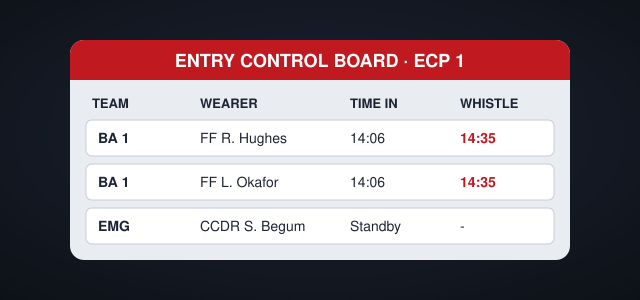

# BA Entry Control

Entry control keeps track of every wearer committed to a risk area. It **must** be set up before anyone enters, and the Entry Control Operative (ECO) must not wear BA themselves. See also [Hazmat: First Actions](hazmat-first-actions).

> [!CAUTION]
> Never commit wearers without a working entry control board and an emergency team on standby at Stage 2.

## Stages of entry control

1. **Stage 1:** a single entry point, up to two BA teams, the ECO at the entry point.
2. **Stage 2:** more than two teams or more than one entry point. An Entry Control Point with a dedicated ECO and an emergency team.
3. **Stage 2 (multiple ECPs):** an overall BA sector commander coordinates every ECP.

## ECO responsibilities

- Record time of entry and calculate time of whistle.
- Monitor telemetry and communications with each team.
- Initiate emergency procedures when a wearer is overdue.

### Typical durations

| Cylinder | Working duration | Time to whistle |
|---|---|---|
| 6.8 L, 300 bar | 39 min | 29 min |
| 9.0 L, 300 bar | 52 min | 42 min |

*Entry control board at a Stage 2 entry control point.*

> [!WARNING]
> Low-pressure warning whistles must be acted on immediately: the team withdraws together.

> [!NOTE]
> Telemetry is a support to entry control, never a replacement for it.

> [!TIP]
> Brief teams on their exit route before they go in, using the premises plan if one is available.
